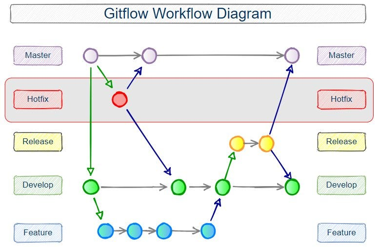

# Guia Essencial de Git Flow
Git Flow é uma metodologia de ramificação no Git que ajuda a organizar o desenvolvimento de software. Ele define um conjunto de regras para criar, integrar e finalizar branches (ramificações). Aqui estão os conceitos básicos para entender e usar Git Flow de forma simples e objetiva:

### Principais Branches
- Main (ou Master):
Contém o código estável e pronto para produção.
Mantenha sempre funcional e pronta para ser lançada.

- Develop:
Contém o código para o próximo release.
Serve como branch de integração onde as features são mescladas.

### Tipos de Branches no Git Flow
- Feature Branches:
Usadas para desenvolver novas funcionalidades.
  - Base: develop
  - Nome padrão: feature/nome-da-feature
  - Fluxo: Criar a partir de develop, trabalhar na feature, e depois mesclar de volta em develop.

```bash
git checkout develop
git checkout -b feature/nome-da-feature
## Trabalhe na feature
git add .
git commit -m "Mensagem de commit"
git checkout develop
git merge feature/nome-da-feature
git branch -d feature/nome-da-feature
```
- Release Branches:
Usadas para preparar uma nova versão para produção.
  - Base: develop
  - Nome padrão: release/nome-da-release
  - Fluxo: Criar a partir de develop, fazer ajustes finais e depois mesclar em main e develop.

```bash
git checkout develop
git checkout -b release/nome-da-release
## Faça ajustes finais
git add .
git commit -m "Preparando release"
git checkout main
git merge release/nome-da-release
git checkout develop
git merge release/nome-da-release
git branch -d release/nome-da-release
```
- Hotfix Branches:
Usadas para corrigir bugs críticos em produção.
  - Base: main
  - Nome padrão: hotfix/nome-do-hotfix
  - Fluxo: Criar a partir de main, corrigir o bug e mesclar em main e develop.

```bash
git checkout main
git checkout -b hotfix/nome-do-hotfix
# Corrija o bug
git add .
git commit -m "Corrigindo bug crítico"
git checkout main
git merge hotfix/nome-do-hotfix
git checkout develop
git merge hotfix/nome-do-hotfix
git branch -d hotfix/nome-do-hotfix
```
Passos Básicos de Uso do Git Flow
Instalação do Git Flow:

```bash
brew install git-flow # para macOS
apt-get install git-flow # para Ubuntu/Debian
```

Inicialização do Git Flow no Repositório:

```bash
git flow init
```
Criar uma Feature:

```bash
git flow feature start nome-da-feature
# Trabalhe na feature
git flow feature finish nome-da-feature
```
Criar uma Release:

```bash
git flow release start nome-da-release
# Faça ajustes finais
git flow release finish nome-da-release
```
Criar um Hotfix:

```bash
git flow hotfix start nome-do-hotfix
# Corrija o bug
git flow hotfix finish nome-do-hotfix
```

### Vantagens do Git Flow
- Organização: Estrutura clara de branches para diferentes estágios de desenvolvimento.
- Paralelismo: Facilita o trabalho simultâneo em várias features e correções.
- Histórico Limpo: Histórico de commits organizado por tipo de branch e finalidade.

### Desvantagens do Git Flow
- Complexidade: Pode ser excessivo para projetos pequenos ou equipes muito pequenas.
- Overhead: Requer mais gerenciamento de branches e merges.