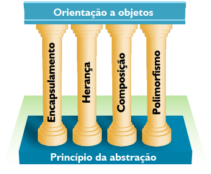
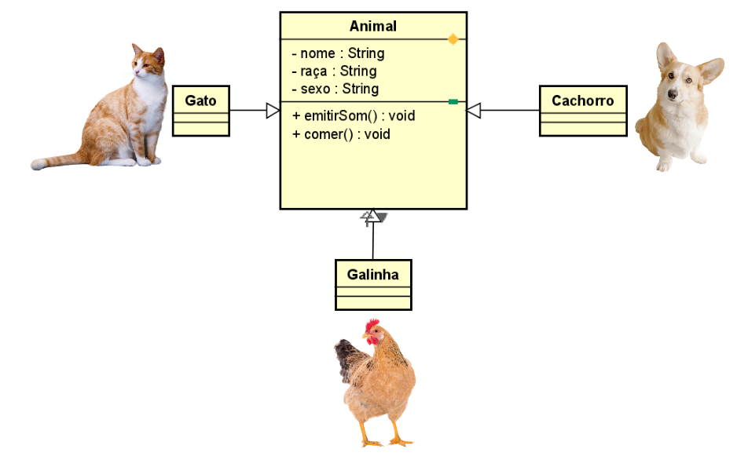
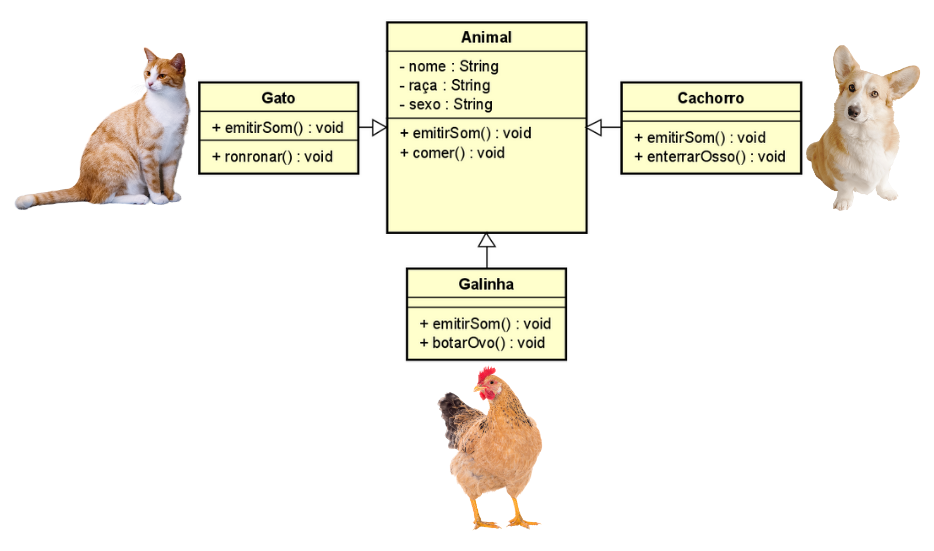
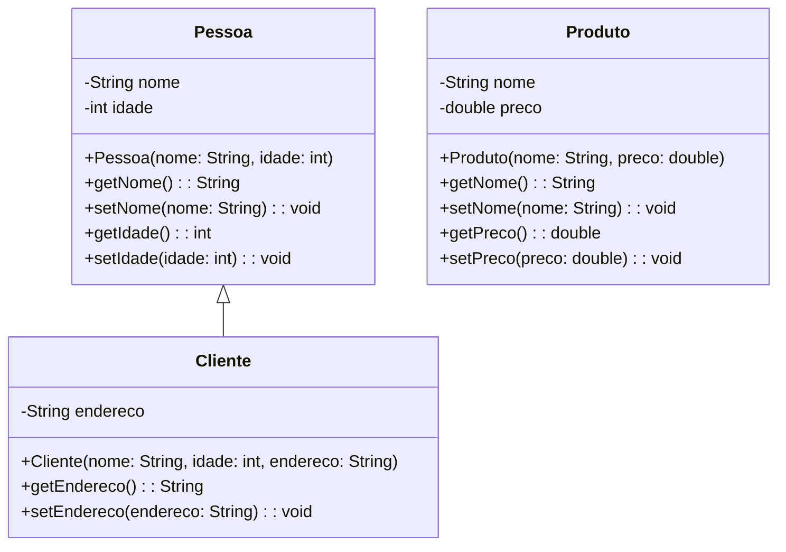

;
# POO - Programação Orientada a Objetos com Java

- [Conceitos de POO](#conceitos-de-poo)
- [Pilares de POO](#pilares-de-poo)
  - [Herança](#herança)
  - [Polimorfismo](#polimorfismo)   
  - [Encapsulamento](#encapsulamento)
  - [Abstração](#abstração)
- [Classes](#classes)
- [Pacotes](#pacotes)
- [Visibilidade](#visibilidade)
- [Getters e Setters](#métodos-getters-e-setters)
- [Construtores](#construtores)
- [Palavras Reservadas](#palavras-reservadas)
  - [This](#this)
  - [Static](#static)
  - [Final](#final)
  - [Super](#super)
  - [new](#new)
  - [implements](#implements)
  - [extends](#extends)
  - [instanceof](#instanceof)
- [Enumeradores(enums)](#enumeradoresenums)
- [Diagrama de Classes](#diagrama-de-classes)

## Conceitos de POO
Você já ouviu falar da expressão linguagem de baixo e de alto nível?
À medida que a tecnologia vem evoluindo, as linguagens de programação também.

**Baixo nível**: São linguagens que estão mais próximas da interpretação da máquina diante do algoritmo desenvolvido.
Exemplo: Assembly e C

**Alto nível**: São linguagens que disponibilizam uma proposta de sintaxy mais próxima de interpretação humana. Exemplo: Java, JavaScript e Python

**Olá Mundo em Assembly**

Assembly é uma linguagem de baixo nível, o que significa que está mais próxima do código de máquina e requer um conhecimento detalhado da arquitetura do processador. Aqui está um exemplo de "Olá Mundo" em Assembly x86 para sistemas operacionais Unix-like (Linux).
```assembly
section .data
    hello db 'Olá Mundo', 0

section .text
    global _start

_start:
    mov edx, 10
    mov ecx, hello
    mov ebx, 1
    mov eax, 4
    int 0x80

    mov ebx, 0
    mov eax, 1
    int 0x80
```

**Olá Mundo em Python**

Python é uma linguagem de alto nível, projetada para ser fácil de ler e escrever. Aqui está o mesmo exemplo em Python:

```python
print("Olá Mundo")
```

### Paradigmas

POO é um paradigma de programação que utiliza "objetos" – instâncias de classes – para modelar e organizar o código de software de forma mais próxima à realidade. Seu principal objetivo é aumentar a modularidade, reusabilidade e manutenção do código.

[voltar ao topo](#poo---programação-orientada-a-objetos-com-java)

---

## Pilares de POO
;

### Herança

Herança permite que uma classe herde caracteristicas(atributos) e comportamentos(métodos) de outra classe, promovendo a reutilização de código.

#### Como Funciona em Java:

- Usamos a palavra-chave **extends** para indicar que uma classe herda de outra.
- A classe que herda é chamada de subclasse ou classe derivada, e a classe herdada é chamada de superclasse ou classe base.

### Polimorfismo  

Cada animal possui seus proprios métodos e metodos da superclasse personalizados

Polimorfismo é a capacidade de um método agir de diferentes formas com base no objeto que a invoca.

#### Como Funciona em Java:

O polimorfismo pode ser alcançado através da sobrecarga de métodos (mesmo nome, diferentes parâmetros) ou da sobrescrita de métodos (subclasses fornecendo implementações específicas de métodos da superclasse).

### Encapsulamento
Encapsulamento é o princípio de esconder os detalhes internos de um objeto e expor apenas o necessário para a interação com ele.

#### Como Funciona em Java:

- Usamos modificadores de acesso (private, protected, public) para controlar a visibilidade dos atributos e métodos de uma classe.
- Atributos de uma classe geralmente são definidos como private e acessados através de métodos getter e setter.
### Abstração
Abstração é o conceito de simplificar complexidade ocultando detalhes irrelevantes e expondo apenas os aspectos essenciais.

#### Como Funciona em Java:

- Usamos classes abstratas (abstract) e interfaces para definir métodos que devem ser implementados por classes concretas.

[voltar ao topo](#poo---programação-orientada-a-objetos-com-java)

---

## Classes
Toda a estrutura de código em Java é distribuído em arquivos com extensão .java denominados de classe.

As classes são compostas por: **Identificador, Atributos e metodos**
### Identificador
Como qualquer identificador em Java, o nome de uma classe deve obedecer às seguintes regras:
Iniciar com uma letra, ou um dos caracteres: '$', '_'.
Conter somente caracteres Unicode considerados letras, dígitos ou um dos dois caracteres acima.
Não pode ser igual a uma palavra-chave reservada pela linguagem Java, tal como void, int, for, while, etc.

### Atributos
São as caracteristicas, é toda informação que representa o estado do objeto.
### metodos
São os comportamentos, é toda parte comportamental que um objeto dispõe.

### Exemplo
```java
    public class Pessoa{//<-- identificador da classe
        String nome;//<-- Atributos 
        int idade;

        void andar(int passos){//<-- metodos
            //codigo aqui
        }
        void falar(String palavras){
            //codigo aqui
        }
    }
```

[voltar ao topo](#poo---programação-orientada-a-objetos-com-java)

---

## Pacotes
Pacotes em Java são uma forma de organizar e agrupar classes e interfaces relacionadas. Eles ajudam a evitar conflitos de nomes e facilitam a manutenção e a organização do código. Pense nos pacotes como pastas em um sistema de arquivos onde você guarda arquivos relacionados.

### Como Funciona:
**Declaração**: No início de um arquivo Java, você declara o pacote com a palavra-chave package seguida pelo nome do pacote.

```java
package com.exemplo.meupacote;
```
### Estrutura:
A estrutura de diretórios no seu sistema de arquivos deve refletir a estrutura dos pacotes. Por exemplo, com.exemplo.meupacote seria uma série de pastas aninhadas: com/exemplo/meupacote.

**Importação**: Para usar classes de outros pacotes, você precisa importá-las. Isso é feito com a palavra-chave import.

```java
import com.exemplo.outropacote.MinhaClasse;
```
### Benefícios:
**Organização**: Mantém o código organizado e modular.
**Reuso**: Facilita o reuso de classes e métodos em diferentes partes do projeto.
**Evita Conflitos**: Impede conflitos de nomes de classes, pois duas classes com o mesmo nome podem existir em pacotes diferentes.
**Exemplo Prático**:
```java
// Arquivo: com/exemplo/meupacote/MinhaClasse.java
package com.exemplo.meupacote;

public class MinhaClasse {
    public void meuMetodo() {
        System.out.println("Olá do meu pacote!");
    }
}

// Arquivo: com/exemplo/outropacote/Teste.java
package com.exemplo.outropacote;

import com.exemplo.meupacote.MinhaClasse;

public class Teste {
    public static void main(String[] args) {
        MinhaClasse obj = new MinhaClasse();
        obj.meuMetodo();
    }
}
```
Neste exemplo, MinhaClasse está no pacote com.exemplo.meupacote, e é importada no arquivo Teste que está no pacote com.exemplo.outropacote. Isso demonstra como pacotes são usados para organizar e reutilizar código.
[voltar ao topo](#poo---programação-orientada-a-objetos-com-java)

---

## Visibilidade
Em Java, a visibilidade, também conhecida como controle de acesso, determina onde e como as classes, métodos e variáveis podem ser acessados. Existem quatro níveis principais de visibilidade:

### Público (public):

**Classe**: Pode ser acessada de qualquer lugar. <br>
**Método/Variável**: Pode ser acessado de qualquer classe.
```java
public class MinhaClassePublica {
    public int meuAtributoPublico;
    
    public void meuMetodoPublico() {
        // código
    }
}
```
### Protegido (protected):

**Classe**: Não aplicável.<br>
**Método/Variável**: Pode ser acessado dentro do mesmo pacote e por subclasses (mesmo se estiverem em pacotes diferentes).
```java
class MinhaClasseProtegida {
    protected int meuAtributoProtegido;
    
    protected void meuMetodoProtegido() {
        // código
    }
}
```
### Pacote-Privado (default):

**Classe**: Pode ser acessada apenas por outras classes no mesmo pacote. <br>
**Método/Variável**: Pode ser acessado apenas por classes no mesmo pacote.
```java
class MinhaClassePadrao {
    int meuAtributoPadrao;  // visibilidade padrão
    
    void meuMetodoPadrao() {
        // código
    }
}
```
### Privado (private):

**Classe**: Não aplicável. <br>
**Método/Variável**: Pode ser acessado apenas dentro da própria classe onde é declarado.
```java
class MinhaClassePrivada {
    private int meuAtributoPrivado;
    
    private void meuMetodoPrivado() {
        // código
    }
}
```
### Resumo:
- **Public**: Acessível de qualquer lugar.
- **Protected**: Acessível no mesmo pacote e por subclasses.
- **Default (Package-Private)**: Acessível apenas no mesmo pacote.
- **Private**: Acessível apenas na própria classe.
[voltar ao topo](#poo---programação-orientada-a-objetos-com-java)

---

## Métodos Getters e Setters
Em Java, getters e setters são métodos usados para acessar e modificar os atributos de uma classe de forma controlada. Eles seguem o princípio do encapsulamento, que visa proteger os dados e garantir que a lógica de negócio seja mantida.

**Getter**: Método que retorna o valor de um atributo.<br>
**Setter**: Método que define ou atualiza o valor de um atributo.
### Estrutura Padrão:
**Getter**: Geralmente começa com get seguido do nome do atributo com a primeira letra maiúscula.
```java
public Tipo getNomeAtributo() {
    return nomeAtributo;
}
```
**Setter**: Geralmente começa com set seguido do nome do atributo com a primeira letra maiúscula.
```java
public void setNomeAtributo(Tipo valor) {
    this.nomeAtributo = valor;
}
```

### Exemplo Prático:
Vamos criar uma classe Pessoa com atributos privados e métodos getters e setters para esses atributos.

```java
public class Pessoa {
    private String nome;
    private int idade;

    // Getter para o atributo 'nome'
    public String getNome() {
        return nome;
    }

    // Setter para o atributo 'nome'
    public void setNome(String nome) {
        this.nome = nome;
    }

    // Getter para o atributo 'idade'
    public int getIdade() {
        return idade;
    }

    // Setter para o atributo 'idade'
    public void setIdade(int idade) {
        if (idade > 0) {  // Exemplo de verificação
            this.idade = idade;
        } else {
            System.out.println("Idade deve ser positiva.");
        }
    }
}
```
Utilização dos Getters e Setters:
```java
public class Teste {
    public static void main(String[] args) {
        Pessoa pessoa = new Pessoa();
        
        // Usando os setters para definir os valores dos atributos
        pessoa.setNome("João");
        pessoa.setIdade(25);
        
        // Usando os getters para acessar os valores dos atributos
        System.out.println("Nome: " + pessoa.getNome());
        System.out.println("Idade: " + pessoa.getIdade());
        
        // Tentando definir uma idade inválida
        pessoa.setIdade(-5);  // Vai imprimir mensagem de erro
    }
}
```
### Benefícios dos Getters e Setters:
- **Encapsulamento**: Protege os dados internos da classe.
- **Validação**: Permite adicionar lógica de validação ao definir valores.
- **Manutenção**: Facilita a manutenção e evolução do código, pois altera-se a implementação sem mudar a interface pública.
- **Resumo**:
- Getters retornam os valores dos atributos.
- Setters permitem modificar os valores dos atributos, possivelmente com validações.
- Encapsulamento é a prática de manter os atributos privados e expor métodos públicos para acesso controlado.
[voltar ao topo](#poo---programação-orientada-a-objetos-com-java)

---

## Construtores
Construtores são métodos especiais utilizados para inicializar objetos. Eles são chamados automaticamente quando um objeto é criado. Construtores têm o mesmo nome da classe e não têm tipo de retorno, nem mesmo void.

### Tipos de Construtores
#### Construtor Padrão (Default Constructor):
É fornecido pelo Java automaticamente se nenhum construtor for definido. Inicializa os atributos com valores padrão (zero, null, etc.).

#### Construtor Parametrizado:

Permite inicializar objetos com valores específicos no momento da criação.<br>
Exemplo Simples <br>

```java
public class Pessoa {
    private String nome;
    private int idade;

    // Construtor padrão
    public Pessoa() {
        System.out.println("Construtor padrão chamado");
        this.nome = "Sem nome";
        this.idade = 0;
    }

    // Construtor parametrizado
    public Pessoa(String nome, int idade) {
        System.out.println("Construtor parametrizado chamado");
        this.nome = nome;
        this.idade = idade;
    }
}
```
Utilizando os Construtores
```java
public class Teste {
    public static void main(String[] args) {
        // Usando o construtor padrão
        Pessoa pessoa1 = new Pessoa();  // Construtor padrão chamado

        // Usando o construtor parametrizado
        Pessoa pessoa2 = new Pessoa("João", 25);  // Construtor parametrizado chamado
    }
}
```
### Resumo
- Construtores são métodos especiais usados para inicializar objetos.
- Construtor Padrão: Inicializa atributos com valores padrão e é fornecido automaticamente se nenhum outro construtor for definido.
- Construtor Parametrizado: Recebe parâmetros que permitem inicializar atributos com valores específicos.
- Uso de Construtores: Facilita a criação e a inicialização de objetos de forma controlada.
[voltar ao topo](#poo---programação-orientada-a-objetos-com-java)

---
## Palavras reservadas
### This
O this em Java é uma referência para o objeto atual em que o código está sendo executado. Ele pode ser usado em diferentes contextos para se referir a diferentes coisas.

Usos Principais do this
Referência a Atributos: O this pode ser usado dentro de métodos para se referir aos atributos da própria classe.

```java
public class Pessoa {
    private String nome;

    public void setNome(String nome) {
        this.nome = nome; // 'this' refere-se ao atributo 'nome' da classe
    }
}
```
Referência a Métodos: Também pode ser usado para chamar outro construtor da mesma classe ou outro método da própria classe.

```java
public class Pessoa {
    private String nome;
    private int idade;

    // Construtor parametrizado chamando o construtor padrão
    public Pessoa() {
        this("Sem nome", 0); // Chama o construtor parametrizado da própria classe
    }
}
```
### Resumo
O this em Java é uma referência ao objeto atual.<br>
Ele é usado para distinguir entre atributos/métodos da classe e parâmetros com o mesmo nome, para chamar outros construtores ou métodos da mesma classe e para referenciar os próprios atributos dentro dos métodos da classe.
[voltar ao topo](#poo---programação-orientada-a-objetos-com-java)

---

### Static

Em Java, a palavra-chave static é usada para criar variáveis e métodos que pertencem à própria classe, não a instâncias específicas da classe.

#### Exemplos:
##### Atributos Estáticos:
São compartilhados por todas as instâncias da classe.
##### Exemplo: contador de objetos criados.

```java
public class Exemplo {
    public static int contador = 0;
}
```
##### Métodos Estáticos:
Podem ser chamados sem criar uma instância da classe.
##### Exemplo: método utilitário para calcular uma operação.

```java
public class Util {
    public static int soma(int a, int b) {
        return a + b;
    }
}
```
##### Acesso aos Membros Estáticos:
##### Atributos Estáticos:
Acessados usando o nome da classe.
```java
int valor = Exemplo.contador;
```
##### Métodos Estáticos:
Chamados usando o nome da classe.
```java
int resultado = Util.soma(3, 5);
```
##### Quando Usar Membros Estáticos:
- Quando você precisa compartilhar valores entre todas as instâncias da classe.
- Para métodos utilitários que não dependem do estado de um objeto específico.
#### Resumo:
- Membros estáticos pertencem à classe, não às instâncias da classe.
- São úteis para compartilhar valores entre todas as instâncias da classe e para métodos utilitários.
- Eles são acessados usando o nome da classe, não o nome do objeto.
[voltar ao topo](#poo---programação-orientada-a-objetos-com-java)

---

### Final
A palavra-chave final em Java é usada para declarar constantes ou para prevenir a modificação de classes, métodos ou variáveis.

#### Usos:

- Variáveis: Uma variável final não pode ser modificada após ser inicializada.

```java
final int idade = 30;
// idade = 40; // Isto causaria um erro de compilação
```
- Métodos: Um método final não pode ser sobrescrito por subclasses.

```java
public class Animal {
    public final void dormir() {
        System.out.println("Dormindo...");
    }
}
```
- Classes: Uma classe final não pode ser estendida por outras classes.

```java
public final class Pessoa {
    // Esta classe não pode ser estendida
}
```
---

### Super
A palavra-chave super é usada para acessar membros (atributos e métodos) da superclasse imediata da classe atual.

#### Usos:

- Acessar Métodos da Superclasse:

```java
public class Animal {
    public void fazerSom() {
        System.out.println("O animal faz um som");
    }
}

public class Cachorro extends Animal {
    @Override
    public void fazerSom() {
        super.fazerSom(); // Chama o método da superclasse
        System.out.println("O cachorro late");
    }
}
```
- Chamar o Construtor da Superclasse:

```java
public class Animal {
    public Animal(String nome) {
        System.out.println("Animal: " + nome);
    }
}

public class Cachorro extends Animal {
    public Cachorro(String nome) {
        super(nome); // Chama o construtor da superclasse
    }
}
```
---

### new
A palavra-chave new é usada para criar novas instâncias de objetos.

#### Uso:

```java
public class Pessoa {
    String nome;

    public Pessoa(String nome) {
        this.nome = nome;
    }
}

public class Teste {
    public static void main(String[] args) {
        Pessoa pessoa = new Pessoa("João"); // Cria um novo objeto Pessoa
    }
}
```
---

### implements
A palavra-chave implements é usada por uma classe para indicar que ela está implementando uma ou mais interfaces.

#### Uso:

```java
public interface Animal {
    void fazerSom();
}

public class Cachorro implements Animal {
    @Override
    public void fazerSom() {
        System.out.println("O cachorro late");
    }
}
```
---

### extends
A palavra-chave extends é usada para indicar que uma classe está herdando de outra classe.

#### Uso:

```java
public class Animal {
    public void fazerSom() {
        System.out.println("O animal faz um som");
    }
}

public class Cachorro extends Animal {
    @Override
    public void fazerSom() {
        System.out.println("O cachorro late");
    }
}
```
---

### instanceof
A palavra-chave instanceof é usada para testar se um objeto é uma instância de uma classe específica ou implementa uma interface específica.

#### Uso:

```java
public class Animal {}

public class Cachorro extends Animal {}

public class Teste {
    public static void main(String[] args) {
        Animal animal = new Cachorro();
        
        if (animal instanceof Cachorro) {
            System.out.println("animal é uma instância de Cachorro");
        }
    }
}
```
---

## Enumeradores(enums)

Enums (abreviação de enumerações) em Java são uma forma de criar um tipo de dado que consiste em um conjunto fixo de constantes. Eles permitem definir um conjunto limitado de valores que uma variável pode ter.

### Declaração de Enums
Para definir um enum em Java, você usa a palavra-chave enum, seguida pelo nome do enum e, entre chaves, uma lista de constantes separadas por vírgula.

```java
public enum DiaDaSemana {
    SEGUNDA, TERCA, QUARTA, QUINTA, SEXTA, SABADO, DOMINGO
}
```
### Utilizando Enums
Uma vez definido, você pode usar um enum da mesma forma que qualquer outro tipo de dado em Java.

```java
public class Teste {
    public static void main(String[] args) {
        DiaDaSemana dia = DiaDaSemana.SEGUNDA;
        System.out.println("Hoje é " + dia);
    }
}
```
### Métodos e Atributos em Enums
Você pode adicionar métodos e atributos aos enums, assim como em outras classes.

```java
public enum DiaDaSemana {
    SEGUNDA("Segunda-feira"),
    TERCA("Terça-feira"),
    QUARTA("Quarta-feira"),
    QUINTA("Quinta-feira"),
    SEXTA("Sexta-feira"),
    SABADO("Sábado"),
    DOMINGO("Domingo");

    private String nomeCompleto;

    DiaDaSemana(String nomeCompleto) {
        this.nomeCompleto = nomeCompleto;
    }

    public String getNomeCompleto() {
        return nomeCompleto;
    }
}
```
### Utilizando Métodos e Atributos em Enums
```java
public class Teste {
    public static void main(String[] args) {
        DiaDaSemana dia = DiaDaSemana.QUARTA;
        System.out.println("Hoje é " + dia); // Saída: Hoje é QUARTA

        System.out.println("Nome completo: " + dia.getNomeCompleto()); // Saída: Nome completo: Quarta-feira
    }
}
```
### Vantagens dos Enums
- **Clareza**: Tornam o código mais legível, pois fornecem nomes significativos para valores.
- **Segurança**: Evitam erros de digitação e garantem que os valores estejam dentro do conjunto permitido.
- **Facilidade de Manutenção**: Facilitam a adição de novos valores sem afetar o restante do código.
### Resumo
- Enums em Java são uma forma de representar um conjunto fixo de constantes.
- Permitem definir um tipo de dados com um conjunto limitado de valores.
- Podem ter métodos e atributos como qualquer outra classe em Java.
- São úteis para tornar o código mais legível, seguro e fácil de manter.
[voltar ao topo](#poo---programação-orientada-a-objetos-com-java)

---

## Diagramas UML (Unified Modeling Language)

Diagramas UML são uma linguagem visual utilizada para modelar e representar sistemas orientados a objetos. Eles fornecem uma maneira padronizada de visualizar as diferentes partes de um sistema, suas interações e comportamentos. Existem vários tipos de diagramas UML, cada um focado em aspectos específicos do sistema.

### Tipos de Diagramas UML Mais Comuns
**Diagrama de Casos de Uso**: Representa os requisitos funcionais do sistema, mostrando as interações entre atores externos e os casos de uso do sistema.

**Diagrama de Classes**: Mostra a estrutura estática do sistema, incluindo as classes do sistema, seus atributos, métodos e relacionamentos.

**Diagrama de Sequência**: Descreve a interação entre objetos ao longo do tempo, mostrando a sequência de mensagens trocadas entre os objetos.

**Diagrama de Estado**: Modela o comportamento dos objetos em diferentes estados, mostrando as transições entre esses estados.

**Diagrama de Atividades**: Representa o fluxo de controle do sistema, mostrando as atividades e a ordem em que são executadas.

### Diagrama de Classes

O diagrama de classes é uma das ferramentas mais importantes na modelagem de sistemas orientados a objetos. Ele representa a estrutura estática de um sistema, mostrando as classes do sistema, seus atributos, métodos e os relacionamentos entre elas.

Componentes do Diagrama de Classes:
Classe:

Representa uma entidade do sistema, geralmente com um nome centralizado.
Pode conter atributos e métodos.
Sintaxe: +atributo: Tipo para atributos públicos, -atributo: Tipo para atributos privados, +método(): TipoRetorno para métodos públicos e -método(): TipoRetorno para métodos privados.
#### Atributos:

Representam características ou propriedades da classe.
São declarados dentro da classe com seus tipos de dados.
#### Métodos:

Representam operações ou comportamentos da classe.
Também são declarados dentro da classe, especificando seus tipos de retorno e parâmetros.
#### Relacionamentos:

Representam como as classes estão conectadas umas com as outras.
Podem ser associações, agregações, composições, heranças ou dependências.
Tipos de Relacionamentos:
#### Associação:

Indica que uma classe está relacionada a outra de alguma forma.
Pode ser bidirecional ou unidirecional.
#### Agregação:

Indica que uma classe é composta por outras classes.
É uma relação de "tem um".
#### Composição:

É uma forma especial de agregação em que uma classe é composta por outras classes e a vida das partes depende da vida do todo.
É uma relação de "todo-parte".
#### Herança:

Indica que uma classe é uma extensão de outra classe.
A classe filha herda atributos e métodos da classe pai.
#### Dependência:

Indica que uma classe depende de outra para realizar alguma operação.
Geralmente representada por uma seta pontilhada.
Exemplo Prático:




Neste exemplo, temos as classes Pessoa, Cliente e Produto, que são partes de um sistema de e-commerce. A classe Cliente herda da classe Pessoa, indicando uma relação de herança. Cada classe tem seus atributos e métodos associados.
[voltar ao topo](#poo---programação-orientada-a-objetos-com-java)

---
