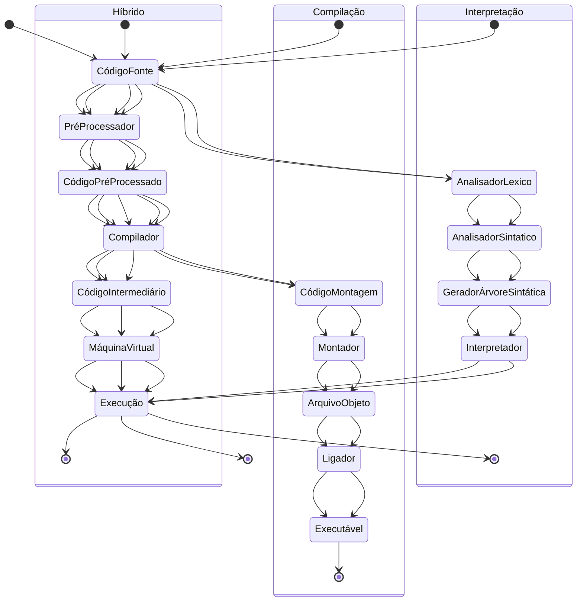

# Linguagens de Programação - Conceitos

## Tópicos
### Conceitos de Linguagens de Programação
- [Razões para estudar Linguagens de Programação](#razões-para-estudar-linguagens-de-programaçã)
- [Domínios de programação](#domínios-de-programação)
- [Critérios de avaliação de linguagens](#critérios-de-avaliação-de-linguagens)
- [Projeto de linguagens](#projeto-de-linguagens)
- [Categorias de Linguagens](#categorias-de-linguagens)
- [Metodos de implementação](#métodos-de-implementação)

### Sintaxe e Semântica

- [O problema geral de descrever sintaxe terminologia](#o-problema-geral-de-descrever-sintaxe-terminologia)
    - [sentença](#sentença)
    - [Linguagem](#linguagem)
    - [Lexema](#lexema)
    - [Token](#token)
### BNF e gramáticas livres de contexto


## Razões para estudar Linguagens de Programação

- Aumenta capacidade em expressar ideias;
- Melhora a capacidade em escolher linguagens apropriadas para cada situação;
- Aumenta a habilidade em aprender novas linguagens;
- Melhora o entendimento da importancia da implementação;
- Melhora o uso de linguagens já conhecidas;

## Domínios de programação

- Aplicações científicas
    - Grande número de computações de aritmética de ponto flutuante;
    - Fortran
- Aplicações empresariais
    - Produz relatório, usa numeros decimais e caracteres
    - COBOL
- Inteligencia artificial
    - Simbolos em vez de numeros manipulados; uso de listas ligadas
    - LISP
- Programação de sistemas
    - Precisa de eficiêcia por causa do uso continuo
    - C
- Software para web
    - Ecletica coleção de linguagens de marcação como XHTML, de scripting como o PHP, de proposito geral como java

## Critérios de avaliação de linguagens

- Legibilidade: Facilidade de leitura e compreensão dos programas criados na linguagem;
    - Uma linguagem com poucos elementos básicos costuma ser mais legível.
    - Multiplicidade de recursos: várias maneiras de fazer a mesma coisa.
    - Sobrecarga de operadores: mais de um significado para um operador, em geral definido pelo tipo de dados dos operandos.
    - Simplicidade em extremo pode dificultar a legibilidade: linguagem de montagem (assembly).
    - Ortogonalidade: conjunto relativamente pequeno de construções primitivas podem ser combinadas em um número relativamente pequeno de maneiras para construir as estruturas de controles e dados de uma linguagem? Em outras palavras, a partir de uma pequena quantidade de conceitos que deve aprender, o programador pode construir programas complexos. Um recurso de linguagem é dito ortogonal quando é independente do contexto.

    - Tipos de Dados:
        - O mesmo tipo de dado ter significados diferentes pode causar confusão.
        - Por exemplo, timeout = 1 em C, timeout é um contador de segundos ou um valor verdadeiro ou falso?

    - Projeto de Sintaxe:
        - Quais são as palavras reservadas de uma linguagem? Elas podem ser usadas como variáveis?
        - “Esse } fecha qual {?”
        - A forma e o significado devem ser consistentes. O mesmo termo ter semântica diferente de acordo com a forma que é usado pode levar a ambiguidades e confusões.


- Facilidade de escrita: facilidade que uma linguagem pode ser usada para determinado dominio;
    - Está diretamente relacionada com a legibilidade.
    - Simplicidade de Ortogonalidade
    - Muitas construções tornam a memorização difícil.
    - Erros podem surgir no uso equivocado de elementos pouco utilizados.
    - Expressividade
    - Exemplo: a possibilidade de usar for, while, do/while para criar laços

- Confiabilidade: Um programa é confiável quando se comporta de acordo com o esperado em qualquer situação.
    - Verificação de Tipos
    - Verificação em tempo de execução versus Verificação em tempo de compilação.
    - Evita a atribuição de valores incompatíveis ou que necessitem de conversão.
    - Tratamento de Exceções
    - Capturar e tratar erros em tempo de execução.
    - Apelidos
    - Dois nomes referenciarem uma mesma posição na memória.
    - É uma característica perigosa.
    - Legibilidade e facilidade de escrita.

- Custo: o custo total definitivo de uma linguagem;
    - Desenvolvimento: facilidade de escrita.
    - Compilação: tempo para geração do executável.
    - Execução: recursos que o executável necessita.
    - Confiabilidade baixa.
    - Manutenção.

## Projeto de Linguagens

### Arquitetura de Computadores

    - von Neumann
    - Linguagens Imperativas
    - Variáveis para representar memória.
    - Laços iterativos para execução de seções adjacentes de código.
    - Contraste com programação funcional.

## Categorias de Linguagens

- Imperativa
- Funcional
- Lógica
    - Linguagens baseadas em regras.
    - Não há ordem definida para as regras pelo desenvolvedor, cabe ao sistema de implementação definir como avalia-las.
- Orientada a Objetos
    - Pode ser considerada uma extensão aos paradigmas Imperativo e Funcional, não uma categoria a parte.

Linguagem imperativa:
```c
#include <stdio.h>

int main() {
    int fat, n;
    printf("Insira um valor: ");
    scanf("%d", &n);
    
    for(fat = 1; n > 1; n = n - 1)
        fat = fat * n;
    
    printf("\nFatorial: %d", fat);
    return 0;
}
```

Linguagem funcional:
```haskell
    factorial :: (Integral a) => a -> a
    factorial 0 = 1
    factorial n = n * factorial (n - 1)
```

## Métodos de Implementação

### Compilação

- Tradução para linguagem de máquina.
- Execução rápida.
- Etapas: Analisador Léxico, Analisador Sintático, Gerador de Código Intermediário, Gerador de Código, Tabela de Símbolos, Ligação e Carga.

### Interpretação

- Código é interpretado por um interpretador.
Não há tradução completa do código fonte.
Execução mais lenta e maior uso de memória.

### Implementação Híbrida

- Tradução para código intermediário (compilação).
Interpretação do código intermediário.
- Implementações Just-in-Time (JIT) permitem reutilizar porções compiladas.
- Uso de pré-processadores para expansão de macros ou substituição de trechos 
de código.

### Diagrama de Implementação



# Sintaxe e Semântica

- Sintaxe: Refere-se à forma ou estrutura das expressões, sentenças e unidades de programas.
- Semântica: Refere-se ao significado dessas expressões, sentenças e unidades de programas.

Exemplo:

```c
int soma = 0;
while(true){
    soma++;
}
```

```c
int soma = 0;
wile(true){ //erro sexico, pois while esta escrito errado
    soma++;
}
```
```c
int soma = 0;
(true)while{ //erro de sintaxe, pois a frase está na ordem incorreta
    soma++;
}
```

## O problema geral de descrever sintaxe: Terminologia
### Sentença
Uma sentença é uma cadeia de caracteres formada a partir do alfabeto
da linguagem.
### Linguagem
Uma linguagem é uma cadeia de sentenças.
### Lexema
Um lexema é a unidade mais básica de significado na análise léxica de uma linguagem de programação. Durante o processo de compilação ou interpretação de um programa, o código-fonte é dividido em tokens, e os lexemas são as sequências de caracteres que correspondem a esses tokens.

Exemplo de Lexemas
Considere a seguinte linha de código em C:

```c
int x = 10;
```
Os lexemas nesta linha de código são:

- `int` - Representa uma palavra-chave para o tipo de dado inteiro.
- `x` - Representa um identificador, ou seja, o nome de uma variável.
- `=` - Representa um operador de atribuição.
- `10` - Representa um literal inteiro.
- `;` - Representa um terminador de sentença.

### Processo de Análise Léxica
- Leitura do Código-Fonte: O analisador léxico (lexer) lê o código-fonte caracter por caracter.
- Agrupamento de Caracteres: Os caracteres são agrupados em lexemas, com base nas regras gramaticais da linguagem de programação.
- Conversão em Tokens: Cada lexema é convertido em um token. Os tokens são objetos que contêm um tipo de token (como palavra-chave, identificador, operador) e o valor do lexema correspondente.

### Importância dos Lexemas
- Fundação da Análise Sintática: A análise léxica é o primeiro passo na compilação, fornecendo os tokens necessários para a análise sintática.
- Identificação de Erros: Lexemas ajudam a identificar erros lexicais no código-fonte, como caracteres inválidos ou identificadores malformados.
- Eficiência: O agrupamento de caracteres em lexemas torna a análise do código mais eficiente e estruturada.

### Token
Um token é uma categoria de lexemas (por exemplo, identificador).

## BNF

A BNF (Backus-Naur Form) é uma notação formal utilizada para descrever a sintaxe das linguagens de programação. Foi originalmente desenvolvida por John Backus e Peter Naur para definir a sintaxe da linguagem ALGOL, e desde então, tornou-se uma ferramenta padrão para especificar as regras gramaticais de muitas linguagens de programação.

### Elementos da BNF
- Produções (Productions): As regras de substituição que definem como símbolos não terminais podem ser substituídos por cadeias de símbolos.
- Símbolos não terminais (Non-terminal symbols): Representam categorias sintáticas que podem ser decompostas em outras categorias ou símbolos terminais.
- Símbolos terminais (Terminal symbols): Os elementos mais básicos da linguagem, que não podem ser decompostos, como palavras-chave, operadores e identificadores.

Estrutura de uma Regra BNF
Uma regra BNF é geralmente representada na forma:

```
<atribuição> -> <variavel> = <expressão>
```